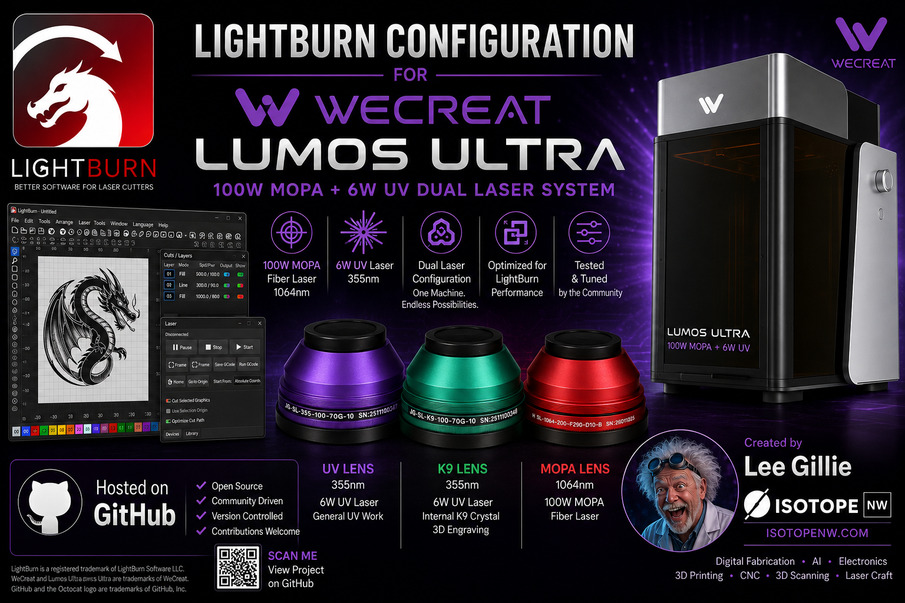

# WeCreat Lumos Ultra — LightBurn Configuration Project



<sub>Banner artwork is aspirational — it shows where this project is going, not where it is.
For actual, current status of every feature see the
[feature inventory](docs/02-feature-inventory.md). Lens part numbers shown are decorative.</sub>

An open, evidence-graded effort to build a working **LightBurn** device configuration for the
**WeCreat Lumos Ultra** (6 W UV + optional 60 W / 100 W JPT MOPA fiber), covering every field
lens, work mode and accessory.

**WeCreat does not publish a LightBurn profile for the Lumos Ultra.** They publish one for the
Vision, Vision Pro, Vista and Lumos — but not the Ultra — while simultaneously listing
"Lightburn" as supported software on the Ultra product page. This repository exists to close
that gap in the open, with contributions from anyone who owns the machine.

> **Status: Stages 0 and 1 complete on hardware.** Architecture, USB identity, baud rate and
> firmware behaviour are **confirmed against a physical Lumos Ultra**. The device profiles in
> `profiles/draft/` remain untested. Every claim carries an evidence grade. Read
> [SAFETY.md](SAFETY.md) before you connect anything.

> ### ⚠️ If you own a Lumos Ultra, do not just import WeCreat's Lumos profile
>
> The Ultra identifies itself over USB as **`[WeCreat Lumos :ver 000240]`** — it does **not** say
> "Ultra". Nothing in the handshake distinguishes the two machines, so WeCreat's official
> `WeCreat-Lumos-v1.5.lbdev` **will connect to an Ultra without complaint**.
>
> That profile declares a **116 × 116 mm** workspace. The Ultra's field is **210 × 210 mm**.
> Jobs would be silently mis-scaled and mis-placed, with no error and no warning.
> ([evidence](captures/stage1-serial-benchy.md))

---

## What we already know (and how well)

| Finding | Grade |
|---|---|
| WeCreat's LightBurn profiles are **GRBL / G-code serial devices**, not galvo controllers | **CONFIRMED** — read out of WeCreat's own `WeCreat-Lumos-v1.5.lbdev`: `"Name": "GRBL"`, `"Type": "Serial"`, `BaudRate 1000000` |
| The Lumos-family controller is a **Linux SBC front-end with a separate MCU** | **CONFIRMED** — WeCreat's bundled RNDIS driver binds `USB\VID_0525&PID_a4a2` and `USB\VID_1d6b&PID_0104&MI_00` (Linux USB gadget IDs); the reverse-engineered REST endpoint is literally `/test/cmd/mcu` |
| WeCreat uses a **private M-code dialect** that is renumbered per machine model | **CONFIRMED** — see [docs/04-mcode-dictionary.md](docs/04-mcode-dictionary.md) |
| MakeIt! 3.0.6 ships **nine distinct Lumos Ultra work modes** | **CONFIRMED** — enumerated from the shipping application bundle, see [docs/06-modes-and-lenses.md](docs/06-modes-and-lenses.md) |
| **The Ultra specifically is a GRBL-over-serial device** | **CONFIRMED-hardware, 2026-08-24** — a physical Lumos Ultra enumerates as a CH340 serial bridge (`VID_1A86&PID_7523`) plus a Linux RNDIS gadget (`VID_0525&PID_A4A2`), with **no galvo controller present**. [Capture](captures/) · [analysis](docs/01-architecture.md#4-confirmed-on-a-physical-lumos-ultra--2026-08-24) |
| The controller sits on a private USB network at `192.168.42.0/24` | **CONFIRMED-hardware** — the RNDIS adapter comes up at `192.168.42.100`, putting the controller at (almost certainly) `192.168.42.1` |
| LightBurn's galvo features (Q-Pulse Width, lens bulge/skew correction, galvo rotary, Split Marking, 3D depth-map) are **unavailable** on a GRBL-typed device | **CONFIRMED for the Lumos**, and now that the Ultra is confirmed GRBL, it inherits the same limits |

The consequence, and it is the important one: **LightBurn cannot drive the Ultra's MOPA pulse
width, cannot do 16-bit depth-map relief, and cannot do K9 internal 3D engraving** — not because
of a missing config file, but because those features live in LightBurn's galvo device class, and
this machine is not a galvo device to LightBurn. Anything recovered there has to come through
custom G-code, not through LightBurn's UI. See
[docs/09-k9-and-mopa-limits.md](docs/09-k9-and-mopa-limits.md).

## What this repository contains

```
docs/         The research. Architecture, feature inventory, M-code dictionary,
              connectivity, modes and lenses, accessories, cameras, K9 crystal,
              .lbdev file format, MakeIt internals, and a full source list.
profiles/     Draft LightBurn device profiles (.lbdev), one per lens/source/mode.
tools/        Scripts to probe your workstation, fetch vendor reference profiles,
              summarize any .lbdev, generate profiles, and inspect MakeIt.
captures/     Where contributors drop their hardware findings. Templates included.
reference/    Local-only working area. Gitignored. Vendor files are NOT redistributed.
```

## Quick start (no laser required)

```powershell
# 1. See what your PC has
powershell -NoProfile -ExecutionPolicy Bypass -File .\tools\probe-workstation.ps1

# 2. Pull WeCreat's official profiles for the other machines, as reference
powershell -NoProfile -ExecutionPolicy Bypass -File .\tools\fetch-vendor-lbdev.ps1

# 3. Read any .lbdev in human form
powershell -NoProfile -ExecutionPolicy Bypass -File .\tools\summarize-lbdev.ps1 .\reference\vendor-lbdev

# 4. Generate the draft Ultra profiles
powershell -NoProfile -ExecutionPolicy Bypass -File .\tools\build-profiles.ps1
```

## Quick start (with a Lumos Ultra)

**Do not skip [SAFETY.md](SAFETY.md).** If the laser lives on a different machine from the one
you author on, [docs/13-test-machine-setup.md](docs/13-test-machine-setup.md) covers getting the
repo onto it and checking it is ready. Then work through
[docs/03-bringup-plan.md](docs/03-bringup-plan.md) in order. Stage 0 and Stage 1 involve no beam
at all and are the most valuable thing any owner can contribute right now.

The three highest-value contributions today, in order:

1. **USB enumeration.** Plug in the Ultra, run `tools/probe-workstation.ps1`, and open an issue
   with the output. This settles the architecture question outright.
2. **The serial banner and `$$` dump.** Connect at 1,000,000 baud and capture what the machine
   says on connect. Expect something shaped like `[WeCreat Lumos Ultra :ver ######]`.
3. **A MakeIt job capture.** Run the same tiny job twice, changing exactly one thing (UV vs
   MOPA; two pulse widths; two focus heights), and capture the G-code. This is how the Ultra's
   M-code table gets written.

Templates for all three live in [`captures/templates/`](captures/templates/).

## How to help

See [CONTRIBUTING.md](CONTRIBUTING.md). Short version: we grade every claim, we never guess in
the documentation, and we never ask anyone to send an unknown M-code to a 100 W fiber laser to
find out what it does. Issues are structured by kind — feature status, M-code discovery, profile
bug, calibration data.

You do not need to own an Ultra to help. Reviewing the docs, improving the tooling, testing the
profile generator, and chasing down sources are all useful.

## Scope and honesty

This project can produce a **LightBurn configuration**. It cannot invent controller capabilities
that WeCreat has not exposed. Where a feature turns out to be MakeIt-only, we will say so plainly
and document *why*, rather than shipping a profile that pretends otherwise.

## Legal

Repository content is MIT licensed — see [LICENSE](LICENSE).

WeCreat's own `.lbdev` files, firmware, and application code are **not redistributed here**.
`tools/fetch-vendor-lbdev.ps1` downloads them from WeCreat's public CDN to your own machine for
comparison, and `reference/` is gitignored. Where this project inspects a locally installed copy
of MakeIt!, it does so to determine the interface the operator's own hardware expects — an
interoperability purpose — and publishes only the resulting factual findings, never WeCreat's code.

This project is not affiliated with, endorsed by, or supported by WeCreat or LightBurn Software.
